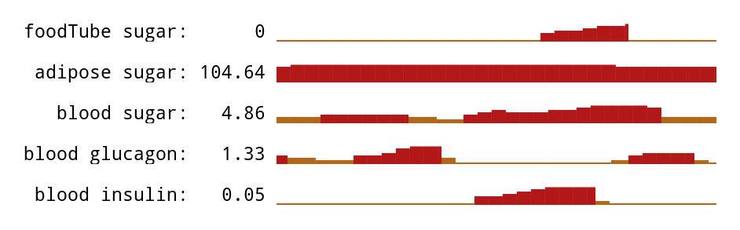

# blood-stream

Some prototype fintec modelled on the human body.

State is passed through the blood-stream and modified as it passes.
The heart pumps the data continuously, and different organs in the stream perform unique functions.

```js
pull(
  heart.source,
  marrow,
  pancreas,
  adipose,
  sample,
  pacemaker(700),
  heart.sink
)
```

In this demo, the pancreas and adipose tissue (fat), collaborate using hormone signalling ([glucagon](https://en.wikipedia.org/wiki/Glucagon)) to raise the blood-sugar level, which is being depleted by the marrow.



## motivation

mix and alanna are merging their finances.
mix was charged with designing the account layout and money flow.
was frustrated by the limitations of current bankings' auto-payments.
this is an exploration of money flows from a self-regulating, bottom-up approach.

